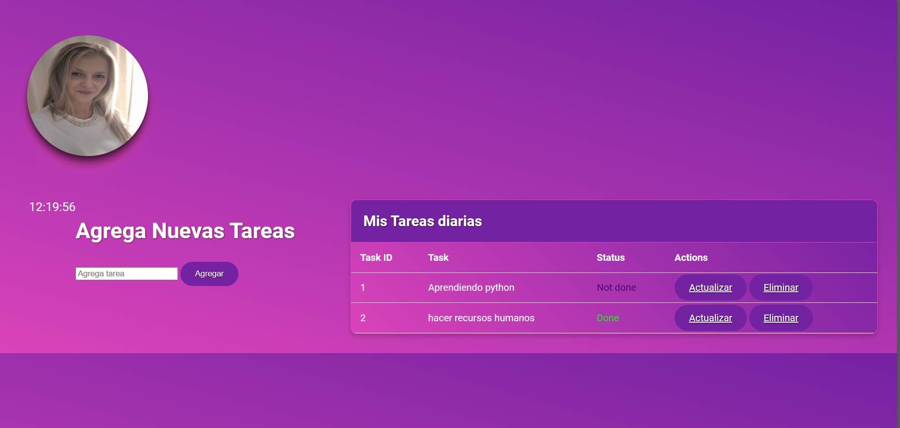

# ToDoList 



Este proyecto consiste en la creación de una lista de tareas, que se divide en dos partes principales:

## Parte 1: Tarea Manager (Ubicado en la carpeta 'tarea-manager')

Esta es una aplicación de consola en Python que utiliza la Programación Orientada a Objetos para gestionar una lista de tareas pendientes. El programa permite al usuario realizar las siguientes operaciones:

- **Agregar una nueva tarea:** Esta función permite al usuario agregar una nueva tarea a la lista de tareas pendientes.
- **Marcar una tarea como completada:** Esta función permite al usuario marcar una tarea como completada, especificando su posición en la lista.
- **Mostrar todas las tareas:** Esta función imprime en pantalla todas las tareas pendientes, numeradas y mostrando su estado (completada o pendiente).
- **Eliminar una tarea:** Esta función permite al usuario eliminar una tarea de la lista, especificando su posición.

Además, el programa incluye las siguientes características:

- **Manejo de excepciones:** El programa maneja excepciones en caso de que el usuario ingrese una opción no válida o una posición que no exista en la lista.

## Parte 2: Interfaz de Usuario (Ubicada en la carpeta 'flask-todo-app')

Esta parte del proyecto es una interfaz de usuario web desarrollada con Flask y SQLite. Para crear la base de datos con SQLAlchemy y utilizarla en la aplicación Flask, sigue los siguientes pasos desde la terminal:

1. Ejecuta `flask shell` para abrir el shell interactivo de Flask.
2. Importa `db` desde la aplicación Flask con el siguiente comando:
   
   ```python
   from app import db
   ```
3. Ejecutar `db.create_all()` para crear las tablas en la base de datos.
4. Arrancar la aplicación Flask utilizando `python app.py`.